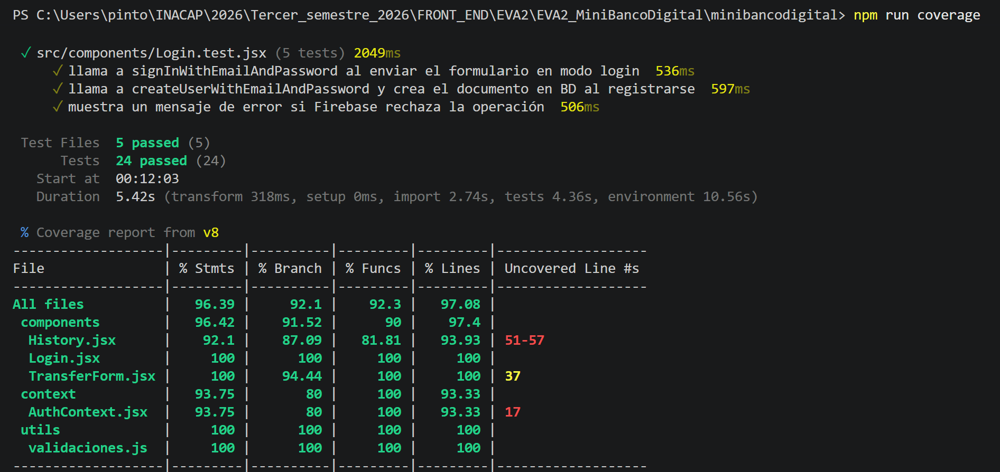

# Mini Banco Digital - XBank

Este proyecto es una Aplicación que simula una plataforma bancaria digital. Ha sido construida utilizando **React**, **Vite** y **Firebase** (Authentication y Cloud Firestore), cumpliendo con estándares de programación reactiva, modularidad de componentes y persistencia de datos en tiempo real.

---

## 🚀 Características Principales

- **Autenticación Segura y Saldo Inicial:** Registro e inicio de sesión integrados con Firebase Auth. Cada usuario nuevo recibe automáticamente un saldo inicial de $100.000 (pesos chilenos) registrado en la base de datos (RF1).
- **Dashboard Reactivo:** Visualización del saldo del usuario en tiempo real mediante suscripciones activas (`onSnapshot`), actualizándose inmediatamente ante cualquier transacción sin necesidad de recargar la página (RF2).
- **Transferencias entre Usuarios:** Transferencias de fondos en vivo con validaciones locales estrictas (verificación de saldo suficiente, montos mayores a $0 y bloqueo de auto-transferencias) antes de impactar la base de datos (RF3).
- **Historial Completo de Movimientos:** Listado cronológico reactivo (del más reciente al más antiguo) que registra transferencias emitidas, recibidas, depósitos y retiros (RF4).
- **Cierre de Sesión:** Desconexión segura que destruye las suscripciones activas para evitar fugas de memoria y redirige al usuario a la pantalla de acceso (RF5).
- **Simulador de Cajero:** Módulo modular para realizar depósitos y retiros con límites transaccionales de seguridad ($500.000 por operación) y validación de fondos.
- **Búsqueda Avanzada y Filtro Múltiple:** Filtrado simultáneo en el historial por tipo de operación, contraparte (búsqueda predictiva por correo) y fecha ajustada a la zona horaria local.
- **Modo Oscuro Persistente:** Interfaz personalizada con variables CSS estructuradas que guarda la preferencia del tema (*Light/Dark*) en el `localStorage` del navegador.
- **Estado Global de la Sesión:** Arquitectura limpia sin *Prop Drilling*, implementando el patrón de diseño **Context API** combinado con **`useReducer`** para una mutación predecible del estado de autenticación.
- **UI/UX FinTech Avanzada:** Interfaz premium diseñada a medida con variables CSS, bordes suavizados, paleta de colores "Slate" y un componente centralizado que renderiza dinámicamente el saldo en una tarjeta débito Platinum virtual usando vectores SVG. Incluye modo oscuro/claro persistente (`localStorage`).

---

## 🛠️ Instrucciones de Instalación y Ejecución Local

Siga estos pasos para clonar, configurar y ejecutar el proyecto en su máquina local de manera segura:

### 1. Requisitos Previos
Asegúrese de tener instalado **Node.js** (versión 16 o superior) y **npm** en su sistema.

### 2. Clonar el Repositorio e Instalar Dependencias
Abra su terminal, navegue hasta la carpeta de destino y ejecute:
```bash
# Instalar los módulos y dependencias de Node estructurados en el package.json
npm install

```

### 3. Configurar Variables de Entorno

Por razones estrictas de seguridad de la información, las credenciales reales de Firebase están protegidas y no se suben al repositorio público.

1. En la raíz del proyecto, busque el archivo plantilla `.env.example`.
2. Duplique el archivo y renombre la copia como `.env`.
3. Complete las variables con sus llaves de configuración del SDK de Firebase:

```env
VITE_FIREBASE_API_KEY="SU_API_KEY_AQUÍ"
VITE_FIREBASE_AUTH_DOMAIN="SU_AUTH_DOMAIN_AQUÍ"
VITE_FIREBASE_PROJECT_ID="SU_PROJECT_ID_AQUÍ"
VITE_FIREBASE_STORAGE_BUCKET="SU_STORAGE_BUCKET_AQUÍ"
VITE_FIREBASE_MESSAGING_SENDER_ID="SU_MESSAGING_SENDER_ID_AQUÍ"
VITE_FIREBASE_APP_ID="SU_APP_ID_AQUÍ"

```

### 4. Ejecución en Entorno de Desarrollo

Una vez configurado el entorno, encienda el servidor local de Vite con el siguiente comando:

```bash
npm run dev

```

La terminal indicará la dirección local. Abra su navegador e ingrese a:
👉 `http://localhost:5173/`

---

## 👥 Usuarios de Prueba

Para evaluar la reactividad bidireccional de las transferencias en tiempo real, se recomienda abrir el sistema en una ventana normal y otra en Modo Incógnito utilizando las siguientes cuentas ya registradas y configuradas con saldo:

* **Usuario 1:**
* **Email:** `g.abarca@gmail.com`
* **Contraseña:** `gabo82`


* **Usuario 2:**
* **Email:** `j.pinto@gmail.com`
* **Contraseña:** `Juan07`


* **Usuario 3:**
* **Email:** `d.paredes@gmail.com`
* **Contraseña:** `dani02`


*Nota: También puede utilizar el enlace de la interfaz para registrar nuevos usuarios con correos válidos de prueba.*

> ⚠️ **Nota importante sobre el entorno de datos:**
> Si está ejecutando este proyecto utilizando sus propias credenciales de Firebase en el archivo `.env`, la base de datos se inicializará vacía. Los usuarios de prueba mencionados arriba no existirán en su entorno. Para evaluar el proyecto, por favor utilice el formulario de registro de la aplicación para crear dos usuarios nuevos; el sistema les asignará automáticamente el saldo inicial de $100.000 para que pueda comenzar a realizar las pruebas de transferencia.

---

## 📊 Modelo de Datos (Cloud Firestore)

La persistencia de datos utiliza un modelo NoSQL optimizado para lecturas rápidas y desacopladas en tiempo real, estructurado en dos colecciones de nivel raíz:

### 1. Colección `users`

Almacena el perfil financiero básico de cada cliente. El ID de cada documento coincide exactamente con el `uid` único proveído por Firebase Authentication, vinculando la sesión con la base de datos de forma directa.

```json
{
  "email": "String (ej: g.abarca@gmail.com)",
  "saldo": "Number (ej: 75000)"
}

```

### 2. Colección `movimientos`

Registra la trazabilidad completa e inmutable de las operaciones. Utiliza una estrategia de desnormalización controlada guardando los correos electrónicos, lo que permite al historial renderizar datos con una única consulta sin necesidad de costosos cruces de información (*JOINs*).

```json
{
  "emisorUid": "String (UID del emisor o 'SISTEMA' en depósitos)",
  "emisorEmail": "String (Correo del emisor o alias del cajero)",
  "receptorUid": "String (UID del receptor o 'SISTEMA' en retiros)",
  "receptorEmail": "String (Correo del receptor o alias del cajero)",
  "monto": "Number (Valor absoluto de la transacción)",
  "fecha": "String (Timestamp en formato extendido ISO 8601 para ordenamiento secuencial)",
  "tipo": "String ('transferencia' | 'deposito' | 'retiro')"
}

```

---

## 🛡️ Defensa Técnica y Arquitectura del Sistema

Esta sección detalla las decisiones de ingeniería aplicadas durante el desarrollo, justificando el diseño de software frente a los requerimientos de la evaluación y las mejores prácticas de la industria.

### 1. Gestión de Estado Global (Evitando el *Prop Drilling*)

* **El Desafío:** En React, transmitir datos de sesión desde el componente raíz hacia componentes anidados profundamente genera *Prop Drilling* (perforación de propiedades), ensuciando el código y dificultando la mantenibilidad.
* **La Solución:** Implementación del patrón **Context API** combinado con el hook **`useReducer`**.
* **Justificación Técnica:** Centralizar la sesión en un único proveedor de contexto (`AuthContext`) permite que cualquier componente acceda a los datos del usuario de forma directa y limpia. Se optó por un *Reducer* debido a que el ciclo de vida de la autenticación obedece a mutaciones de estado estrictas y discretas (`LOGIN`, `LOGOUT`), lo que garantiza un flujo de datos predecible, seguro y escalable.

### 2. Modelo de Datos NoSQL (Desnormalización Controlada)

* **El Desafío:** Evitar el alto costo computacional y la latencia de realizar múltiples consultas cruzadas (simulando un *JOIN* relacional) en Cloud Firestore.
* **La Solución:** Diseño de base de datos basado en **desnormalización controlada** para la colección de `movimientos`.
* **Justificación Técnica:** Al registrar el `email` tanto del emisor como del receptor directamente en cada documento de transacción (en lugar de guardar únicamente sus UIDs atómicos), el componente del historial puede renderizar la interfaz completa con **una única lectura** a la base de datos. Esto optimiza drásticamente el rendimiento del lado del cliente y minimiza la cuota de facturación en la infraestructura de Firebase.

### 3. Optimización de Memoria (Prevención de *Memory Leaks*)

* **El Desafío:** Las suscripciones en tiempo real a bases de datos o sistemas de autenticación pueden saturar la memoria del navegador si el ciclo de vida de los componentes no se gestiona correctamente.
* **La Solución:** Limpieza explícita de observadores activos en el desmontaje de los componentes.
* **Justificación Técnica:** Cada instancia de `onSnapshot` (lectura de Firestore) y `onAuthStateChanged` (escucha de Auth) retorna una función de desuscripción. La arquitectura del sistema asegura que esta función (`unsubscribe()`) se ejecute en el retorno del `useEffect`, destruyendo los canales de comunicación WebSocket al cambiar de vista o cerrar sesión para evitar fugas de memoria.

### 4. Seguridad de Transacciones y Lógica de Negocio

* **El Desafío:** Prevenir la inyección de datos corruptos, bloqueos del servidor o transacciones matemáticamente inválidas hacia la base de datos central.
* **La Solución:** Barreras de validación estricta y control de estado en la capa del cliente antes de invocar los métodos de escritura (`updateDoc`, `addDoc`).
* **Justificación Técnica:** Toda la lógica de negocio restrictiva (verificación de fondos suficientes, bloqueo de montos negativos, prevención de transferencias hacia la propia cuenta y límites transaccionales máximos en el cajero) se ejecuta y valida de forma preventiva localmente. Esto actúa como un *firewall* de primera línea, evitando que el servidor procese operaciones erróneas y protegiendo la integridad transaccional de los clientes.

---

## 🤖 Uso de Inteligencia Artificial y QA

Se utilizó IA para estructurar los observadores en tiempo real (`onSnapshot`) de Firestore y refactorizar el flujo de estados hacia el patrón `useContext` con `useReducer`. El asistente sirvió para acelerar el diseño modular con variables CSS, implementar validaciones locales preventivas antes de mutar la base de datos e identificar rápidamente errores de sintaxis en el árbol de JSX. Durante el proceso, se tuvo que corregir la ubicación del archivo `.env` que inicialmente quedó fuera de la raíz del empaquetador y ajustar el filtro por fechas en JavaScript para alinearlo con la zona horaria local de Chile.

### Registro de Auditoría y Correcciones

1. **Error de Sintaxis JSX (Sopa de Divs)**
* **Fallo inicial de la IA:** Al integrar el componente `<TransferForm />` dentro de `Dashboard.jsx`, el código sugerido dejó dos elementos hermanos sueltos dentro de un operador ternario, rompiendo la regla estricta de React de tener un único nodo padre.
* **Detección:** Se detectó el error de compilación en Vite `[PARSE_ERROR] Expected ',' or '}' but found '{'`.
* **Corrección aplicada:** Se obligó a la reestructuración del código envolviendo los elementos en Fragmentos de React vacíos (`<> ... </>`) para limpiar el árbol del DOM y restaurar la compilación.


2. **Brecha de Seguridad Lógica (Cajero Virtual sin límites)**
* **Fallo inicial de la IA:** El simulador de depósitos y retiros (`CajeroVirtual.jsx`) se entregó con validaciones matemáticas básicas (mayores a cero y saldo suficiente para retiros), pero permitía inyectar cifras irreales o astronómicas en la base de datos.
* **Detección:** Mediante pruebas, se descubrió que el sistema permitía depositar y retirar montos excesivos sin ninguna restricción.
* **Corrección aplicada:** Se exigió la implementación de una constante de seguridad `LIMITE_TRANSACCION` (fijada en $500.000) para bloquear flujos de dinero anómalos.


3. **Omisión de Requisito de Rúbrica (Filtros Incompletos)**
* **Fallo inicial de la IA:** Al abordar la bonificación del historial de movimientos, el código propuesto solo incluía el filtro de búsqueda por "texto/contraparte" y un menú desplegable por "tipo de operación".
* **Detección:** Se auditó el código contra la rúbrica y se evidenció que faltaba el tercer criterio obligatorio estipulado: el filtro por **fecha**.
* **Corrección aplicada:** Se ordenó la inclusión de un tercer estado controlado (`<input type="date">`) para cumplir el requerimiento al 100%.


4. **Defecto de Lógica de Fechas (UTC vs Local Time)**
* **Fallo inicial de la IA:** Tras agregar el filtro por fecha, la lógica de comparación en JavaScript fallaba al confrontar la fecha seleccionada en el input local contra la fecha ISO guardada en la base de datos.
* **Detección:** Al realizar pruebas de selección de fecha en el calendario, el filtro traía todos los datos creados, sin discriminar correctamente.
* **Corrección aplicada:** Se refactorizó la lógica de extracción de fechas (`movimientosFiltrados`) para formatear la fecha extraída de Firebase utilizando `.getFullYear()`, `.getMonth()` y `.getDate()`, obligando al sistema a respetar la **zona horaria local de Chile** en lugar de la zona UTC por defecto.


5. **Falla de Vinculación CSS (Caída del Modo Oscuro)**
* **Fallo inicial de la IA:** Se propusieron las variables globales de CSS (`:root` y `[data-theme="light"]`) y la lógica del botón en `App.jsx`, pero se omitió el paso crítico de asegurar la importación del archivo de estilos.
* **Detección:** Al activar el botón de cambio de tema, la interfaz colapsó visualmente, mostrando una pantalla completamente blanca y perdiendo el renderizado de la tarjeta.
* **Corrección aplicada:** Se identificó que faltaba el puente de conexión y se solucionó agregando la instrucción explícita de `import './index.css';` en el punto de entrada principal (`main.jsx`), restaurando la interfaz de forma definitiva.

# 🏦 XBank - Mini Banco Digital (Fase de Testing)
[](https://github.com/Pintorescoh/EVA2_MiniBancoDigital/actions)

Este repositorio contiene la evaluación de Testing y Refactorización del proyecto XBank, un mini banco digital desarrollado con React y Vite.

## 🛠️ Decisiones Técnicas y Refactorización

Para cumplir con las buenas prácticas de testing (AAA) y aislar las responsabilidades, se realizaron las siguientes modificaciones arquitectónicas:

1. **Extracción de Lógica Pura (utils):** Se separó la lógica de validación de transferencias (`validaciones.js`) fuera de los componentes visuales para permitir pruebas unitarias rápidas y predecibles sin depender del renderizado de React.
2. **Aislamiento de la Base de Datos (services):** Se extrajo toda la interacción con Firebase Firestore (funciones `getDocs`, `updateDoc`, `addDoc`) hacia un archivo independiente (`transferencias.js`). Esto permitió que el componente UI ignorara la implementación de la base de datos.
3. **Mocking de Servicios:** Durante las pruebas del componente `TransferForm`, se utilizó `vi.mock` para secuestrar las llamadas a Firebase. Esto garantiza que la suite de pruebas no consuma red, no altere datos reales y no arroje errores de conexión.

## 🧪 Tecnologías de Pruebas Utilizadas

* **Vitest:** Motor principal de pruebas (reemplazo moderno de Jest).
* **React Testing Library:** Para pruebas de componentes centradas en el comportamiento del usuario y no en los detalles de implementación (render, screen).
* **user-event:** Para simular interacciones reales de teclado y ratón.
* **Coverage-v8:** Para la generación de reportes de cobertura de código.

## 📊 Reporte de Cobertura

El proyecto superó ampliamente la meta del 70%, logrando una cobertura global del **97.08%** y cubriendo todos los componentes críticos exigidos.



## 🤖 Declaración de uso de Inteligencia Artificial

Para el desarrollo de esta fase de testing, utilicé la asistencia de Gemini (Google). La IA fue empleada principalmente como un experto técnico para:
* Guiar la configuración inicial del entorno de Vitest y resolver bugs de resolución de rutas en Windows.
* Diseñar la estrategia de refactorización para extraer la lógica pura y los servicios de Firebase.
* Explicar y aplicar patrones avanzados de testing como `vi.mock` para aislar contextos (`AuthContext`) y servicios asíncronos.